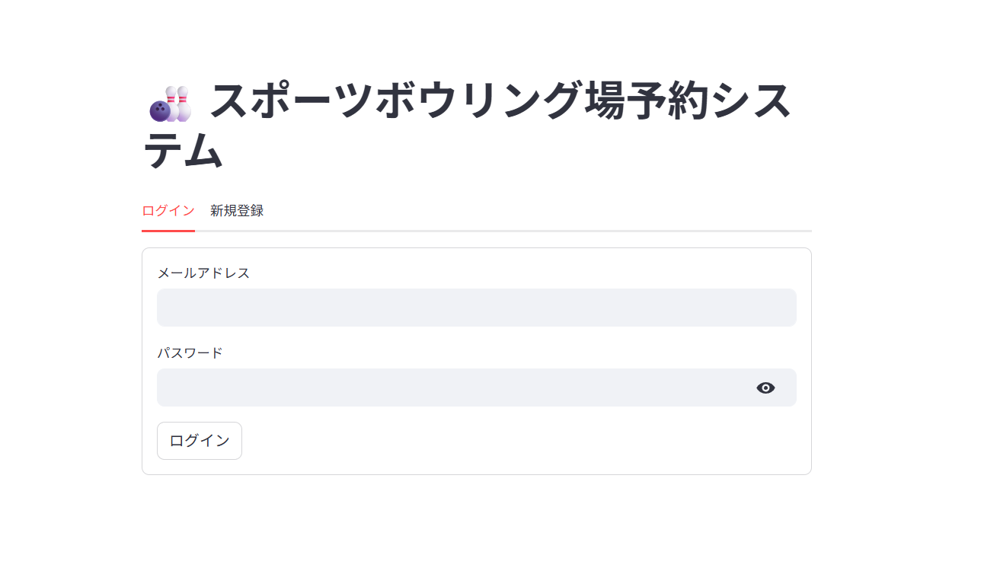
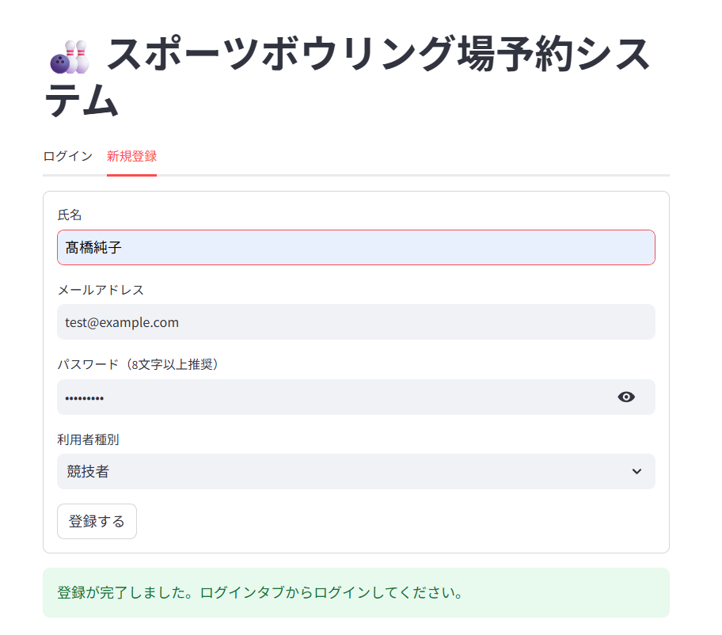
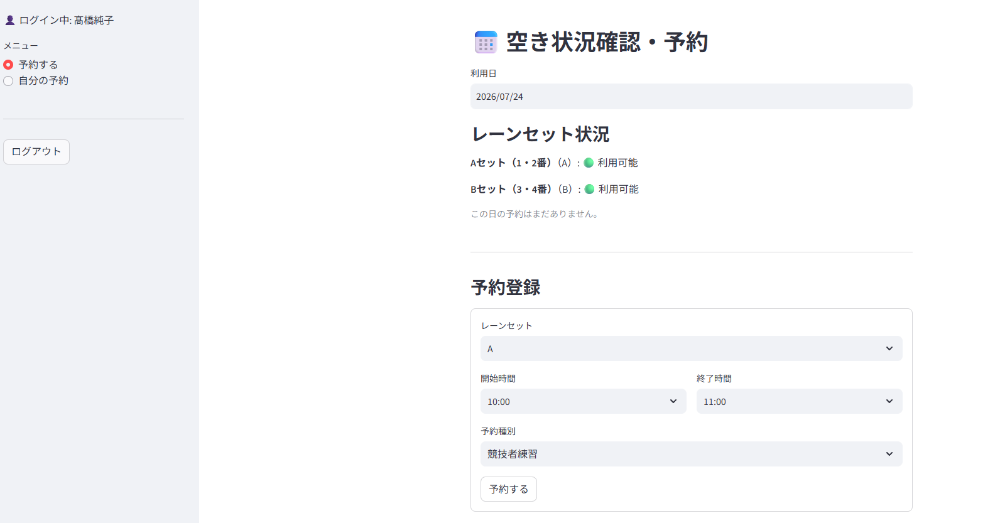
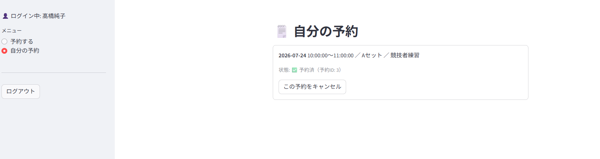
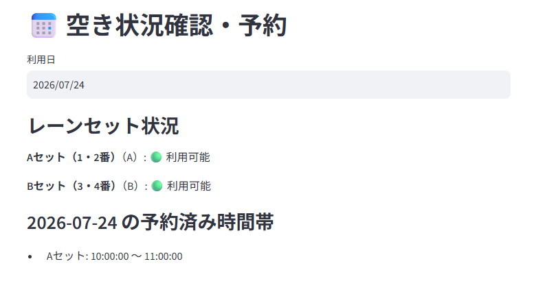

# スポーツボウリング場予約システム — MVP（Claude実装）

要件定義Ver.2.1（追加確定仕様）に基づき、DB設計・API・認証・排他制御・Streamlitフロントエンドまで含めた
動作するMVPです。ローカルで登録→ログイン→予約→キャンセルの一連のフローを
curl（バックエンド）およびStreamlitアプリの起動確認（フロントエンド）で確認済みです。

## 画面イメージ

### ログイン


### 新規登録


### 空き状況確認・予約


### 自分の予約一覧


### 予約後の空き状況（反映確認）


## フォルダ構成

```
プロジェクトフォルダ/
├── README.md
├── backend/
│   ├── requirements.txt
│   └── app/
│       ├── main.py
│       ├── database.py
│       ├── models/
│       ├── schemas/
│       ├── routers/
│       └── utils/
└── frontend/
    ├── app.py
    ├── api_client.py
    └── requirements.txt
```

バックエンドとフロントエンドは別プロセスとして、別々のターミナルで起動します。

## セットアップ

### 1. バックエンド（FastAPI）

`backend`フォルダの中に移動してから実行してください。

```bash
cd backend
pip install -r requirements.txt --break-system-packages
uvicorn app.main:app --reload
```

起動後、`http://127.0.0.1:8000/docs` でSwagger UIから全エンドポイントを試せます。
初回起動時にレーンセット A（1・2番）/ B（3・4番）が自動投入されます。
予約データは`backend`フォルダ内に作られる`bowling.db`に保存され、
サーバーを再起動しても消えません（まっさらな状態に戻したい場合は`bowling.db`を削除してください。
その場合ユーザーアカウントも消えるので、新規登録からやり直しになります）。

### 2. フロントエンド（Streamlit）

別ターミナルで、バックエンドを起動したまま、`frontend`フォルダの中に移動して実行してください。

```bash
cd frontend
pip install -r requirements.txt --break-system-packages
streamlit run app.py
```

`http://localhost:8501` で画面が開きます。バックエンドのURLを変える場合は環境変数
`BOWLING_API_BASE_URL`（デフォルト: `http://127.0.0.1:8000`）で指定してください。

### フロントエンド構成

- `frontend/api_client.py` — バックエンドAPI呼び出しをまとめたラッパー
- `frontend/app.py` — 画面本体。ロール（`user`/`competitor`/`admin`）に応じてメニューを出し分け
  - 一般利用者・競技者: 空き状況確認 / 予約登録 / 自分の予約確認・キャンセル
  - 管理者: 上記に加えて全予約管理・レーン管理（メンテナンス切替）
- トークンは`st.session_state`にのみ保持（ブラウザストレージ不使用。タブを閉じると再ログインが必要）

## 実装済み機能（要件定義11章「MVP完成条件」準拠）

- ユーザー登録・ログイン（JWT認証、bcryptパスワードハッシュ）
- 空き状況確認 (`GET /reservations/availability`)
- 予約登録 (`POST /reservations`)
- 自分の予約確認 (`GET /reservations/me`)
- 予約キャンセル (`DELETE /reservations/{id}`、本人 or 管理者のみ)
- 管理者：全予約確認・キャンセル・レーン管理 (`/admin/*`)

## レビューで確定した設計判断（Copilotが引き継ぐ際の申し送り）

1. **二重予約チェックは2系統**
   - E001: 同一レーンセット×日付で時間帯が重なる予約がないか
   - E002: 同一利用者×日付で、レーンセットが違っても時間帯が重なる予約がないか
   - `app/routers/reservations.py` の `_has_overlap()` で共通化

2. **排他制御はMVP簡易対応**
   SQLiteは真の行ロックが弱いため、`threading.Lock()`でプロセス内の予約作成をシリアライズしています。
   これは**単一プロセスでの動作を前提にした簡易対応**です。複数ワーカーで動かす本番運用や
   PostgreSQL移行時は、`SELECT ... FOR UPDATE`や`UNIQUE`制約+リトライに置き換える必要があります。
   （この制約は README とコード内コメント両方に明記しています）

3. **`purpose`はMVP対象外**（ChatGPT確定事項）。DBにもAPIにもカラム・項目を含めていません。
   後続フェーズで`Reservation`に`purpose`カラムを追加する形で拡張可能です。

4. **`LaneSet.status`はセット単位のみ**（個別レーンの故障管理はPhase2）。
   Phase2で個別管理が必要になった場合は、`Lanes`テーブルを分離し
   `LaneSet`から1対多で持たせる設計に拡張してください（Gemini初期設計案を参照）。

5. **認証はJWT（Bearer token）**。Streamlitフロント実装時は`st.session_state`にトークンを
   保持し、各リクエストのAuthorizationヘッダーに付与する想定です。

6. **予約は30分単位**。バリデーションはDB制約ではなくPydantic（API層）で実施
   （`app/schemas/schemas.py` の `validate_30min_unit`）。

7. **論理削除方式**。`Reservation.status`は`reserved`/`cancelled`のみで物理削除はしません。
   `cancelled_at`にキャンセル日時を記録します。

## 未実装・Copilotへの引き継ぎ事項

- **予約時間変更機能** — 要件定義9章の通りMVP対象外（空き確認・競合チェックが必要なため後続フェーズ）。
- **同日内の過去時刻チェック漏れ** — 現状「過去の日付」はブロックしていますが、「今日の予約で、開始時刻が現在時刻より前」はチェックしていません（例：今日の午前中の時間帯を、午後になってから予約できてしまう）。動作確認中に実際に踏んだ既知の課題です。第一弾ではこのままにしていますが、直す場合は`ReservationCreate`のバリデーションに、日付が今日の場合は開始時刻と現在時刻を比較する条件を1つ足すだけで対応できます。
- **初心者教室・競技者練習の詳細機能** — テーブル構造は`reservation_type`で区分可能な形にしてありますが、
  定員管理（`ClassRegistrations`など）は未実装です。
- **本番運用向けの排他制御強化** — 上記2番を参照。PostgreSQL移行時に見直し必須。
- **`SECRET_KEY`の環境変数管理** — 現状は開発用デフォルト値がハードコードされています
  （`app/utils/auth.py`）。本番相当のデプロイをする場合は必ず環境変数で上書きしてください。

## テスト済みの動作確認項目

curlでの手動テストにより以下を確認しています（自動テストは未整備）：

- ユーザー登録・ログイン・JWT発行
- 予約作成の正常系
- E001（レーンセット重複）が409で正しく弾かれること
- E002（利用者の時間帯重複）が409で正しく弾かれること
- 30分単位バリデーションが422で正しく弾かれること
- E003（他人の予約への操作）が403で正しく弾かれること
- 本人によるキャンセルが正常に成功すること
- 管理者権限チェック（一般ユーザーが`/admin/*`にアクセスすると403）
- レーンのメンテナンス設定と、メンテナンス中レーンへの予約が409で弾かれること

pytest等での自動テスト整備は今後の課題です（テスト担当が決まっていれば、そちらで拡充をお願いします）。

フロントエンドは、Streamlitアプリの起動・ヘルスチェック（`/_stcore/health`が`ok`を返すこと）と、
`/auth/me`を使ったロール判定ロジックの疎通を確認済みです。ブラウザでの実際のクリック操作による
E2Eテストは行っていないため、UIの細かい挙動（フォームのバリデーション表示など）は
実際に触りながら調整が必要な可能性があります。
